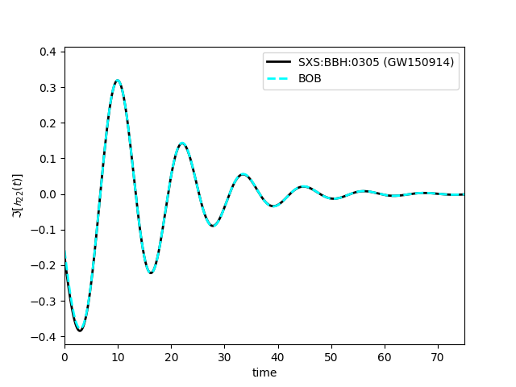

Getting Started
=================

While detailed jupyter tutorial notebooks can be found on the github, here we show the simplest possible example.

.. code-block:: python
    
    from gwBOB import BOB_utils
    import matplotlib.pyplot as plt

    BOB = BOB_utils.BOB()   
    BOB.initialize_with_sxs_data("SXS:BBH:0305")
    BOB.what_should_BOB_create="strain_using_news"
    t,y = BOB.construct_BOB(N=2)
    news_NR = BOB.NR_based_on_BOB_ts

    plt.plot(news_NR.t-BOB.strain_tp,news_NR.y.imag,label='SXS:BBH:0305 (GW150914)',color='black',linewidth=2)
    plt.plot(t-BOB.strain_tp,y.imag,label='BOB',color='cyan',linestyle='dashed',linewidth=2)
    plt.xlabel('time')
    plt.ylabel(r'$\Im[\mathcal{h}_{22}(t)]$')
    plt.xlim(0,75)
    plt.legend()
    plt.show()

