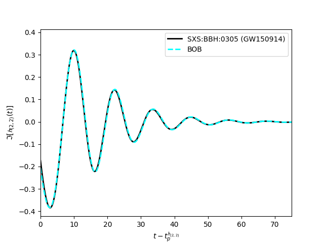

Getting Started
=================

Here we work through a simple example, that goes through several features of BOB.

First we install BOB.

.. code-block:: bash

   pip install gwBOB

Now we can use the code. Let's start by initializing BOB.

.. code-block:: python
    
    from gwBOB import BOB_utils
    import matplotlib.pyplot as plt

    BOB = BOB_utils.BOB()   
    BOB.initialize_with_sxs_data("SXS:BBH:0305")
    #BOB.initialize_with_cce_data(1,perform_superrest_transformation=True) #This will load the first simulation in the public EXT-CCE database and perform a superrest transformation
    BOB.what_should_BOB_create="psi4"

These are the main three commands every BOB code will start with. BOB_utils contains the main BOB class. BOB has three main initialization options. We can initialize using the SXS catalog, the public EXT-CCE catalog, or raw NR data.
Here we use SXS:BBH:0305 as an example. 

The last line tells us what gravitational wave quantity we want to create. The main three options are "psi4", "news", "strain_using_news". While there are more options, those should be used with care. Particularly, there is an option called "strain", that will create the strain assuming that the fundamental BOB amplitude (A_p*sech(t-t_p)/tau).
This will NOT yield good results, and is only present for testing and comparison. Please see (paper in prep.) for more details. 

Now that we have declared we want to create psi4, we can construct BOB using just one line of code.

.. code-block:: python

    t_psi4,y_psi4 = BOB.construct_BOB()
    psi4_NR = BOB.NR_based_on_BOB_ts #This returns a kuibit timeseries. The time and data arrays can be accessed as psi4_NR.t and psi4_NR.y
    #psi4_NR = BOB.psi4_data #returns the resampled full NR data. Similar for news and strain
    #psi4_44_t,psi4_44_y = BOB.get_psi4_data(l=4,m=4). In case we ever need NR data for other modes. This will not work with raw NR data initialization

By default we use the flavor of BOB used in (paper in prep.) which takes :math:`t_0 = -\infty` and :math:`\Omega_0 \approx 0.155`. 
For convenience, this package acts as a wrapper around some utilities of the SXS and scri packages so the user doesn't have to deal with them separately.
We store a lot of the SXS data during the initialization so the user does not have to continously reload the data to test different things. 
BOB.NR_based_on_BOB_ts returns the SXS psi4 data (because we set BOB.what_should_BOB_create="psi4") resampled to the same time series as BOB for easy plotting.

.. code-block:: python

    plt.plot(psi4_NR.t-BOB.psi4_tp,psi4_NR.y.imag,label='SXS:BBH:0305 (GW150914)',color='black',linewidth=2)
    plt.plot(t_psi4-BOB.psi4_tp,y_psi4.imag,label='BOB',color='cyan',linestyle='dashed',linewidth=2)
    plt.xlabel(r'$t - t_p^{\Psi_{4_{(2,2)}}}$')
    plt.ylabel(r'$\Im[\Psi_{4_{(2,2)}}(t)]$')
    plt.xlim(0,75)
    plt.legend()
    plt.show()

It looks good, but not perfect! Next, let's build BOB for what it models the best, the News. We'll use a slightly different flavor of BOB. We will keep :math:`t_0 = -\infty`, but now we will build BOB for the news and let :math:`\Omega_0` be obtained from a least squares fit of the BOB frequency to the NR frequency.
Crucially, we don't have to reinitalize the data!

.. code-block:: python

    BOB.what_should_BOB_create="news"
    BOB.optimize_Omega0 = True
    t_news,y_news = BOB.construct_BOB()
    news_NR = BOB.NR_based_on_BOB_ts

    plt.plot(news_NR.t-BOB.news_tp,news_NR.y.imag,label='SXS:BBH:0305 (GW150914)',color='black',linewidth=2)
    plt.plot(t_news-BOB.news_tp,y_news.imag,label='BOB',color='cyan',linestyle='dashed',linewidth=2)
    plt.xlabel(r'$t - t_p^{\mathcal{N}_{(2,2)}}$')
    plt.ylabel(r'$\Im[\mathcal{N}_{(2,2)}(t)]$')
    plt.xlim(0,75)
    plt.legend()
    plt.show()

Now we compare the News (what BOB builds the best)!

Perfect! But for most use cases, we probably want the strain. It is important to note that the best way to obtain the strain with BOB is to build BOB for either psi4 or the news and integrate to obtain the strain. While many methods exist for the integration,
in the interest of maintaining the analytical nature of BOB, we provide a approximate scheme detailed in (paper in prep). For this scenario, let's build BOB for the news using a finite value for :math:`t_0` using :math:`t_0 = -10`. :math:`\Omega_0` will be determined through the relation 
:math:`\omega = m\Omega_0`, where :math:`\omega` is the waveform frequency and m is the gravitational wave mode number. Because we set :math:`t_0 = -10` and are building the news, this will automatically use the News waveform frequency 10M before the peak of the news waveform to determine :math:`\Omega_0`.

Integrating the news to obtain the strain is a complex problem separate from the physics of BOB. Therefore, we largely leave this to the user's preference. However, we do provide a simple analytic scheme represented as a series (see paper in prep for more details). We can define the number of terms to use in the series during the construction (N=0 is the leading order term). Be careful: using too many terms can cause memory issues!

.. code-block:: python

    BOB.what_should_BOB_create="strain_using_news"
    BOB.optimize_Omega0 = False #turn off our optimization that we set previously
    BOB.set_initial_time = -10 #set t0 to -10M before peak of news
    #BOB.set_initial_time = (-10,True) #This will force the strain waveform to be used to determine omega, even if psi4 or news is being built
    #We can also manually adjust some parameters like
    #BOB.Ap = 1 #manually set the peak BOB amplitude
    #BOB.t_tp_tau = np.linspace(-10,0,100) #manually set the value for (t - t_p)/tau that goes into the BOB amplitude and frequency evolution
    #BOB.t0_tp_tau = np.linspace(-10,0,100) #manually set the value for (t_0 - t_p)/tau that goes into the BOB frequency evolution for finite t0 values
    #BOB.Omega_0 = -1 #manually set the initial frequency
    #BOB.tau = -1 #manually set the damping time
    #BOB.Omega_QNM = -1 #manually set the QNM frequency, note w = m*Omega here where w is your quasinormal mode frequency and m is the mode number
    t_strain,y_strain = BOB.construct_BOB(N=1)
    strain_NR = BOB.NR_based_on_BOB_ts

    plt.plot(strain_NR.t-BOB.strain_tp,strain_NR.y.imag,label='SXS:BBH:0305 (GW150914)',color='black',linewidth=2)
    plt.plot(t_strain-BOB.strain_tp,y_strain.imag,label='BOB',color='cyan',linestyle='dashed',linewidth=2)
    plt.xlabel('time')
    plt.ylabel(r'$\Im[\mathcal{h}_{22}(t)]$')
    plt.xlim(0,75)
    plt.legend()
    plt.show()

